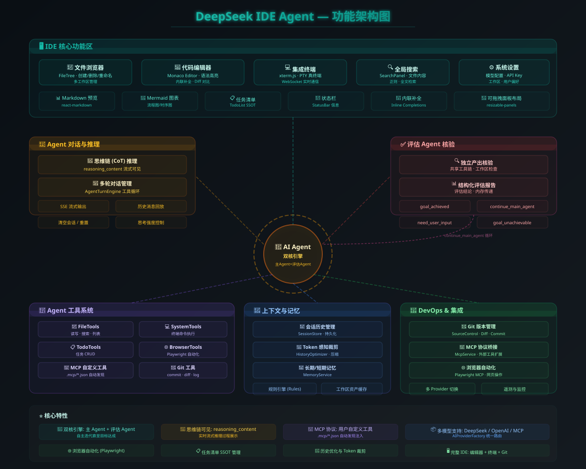
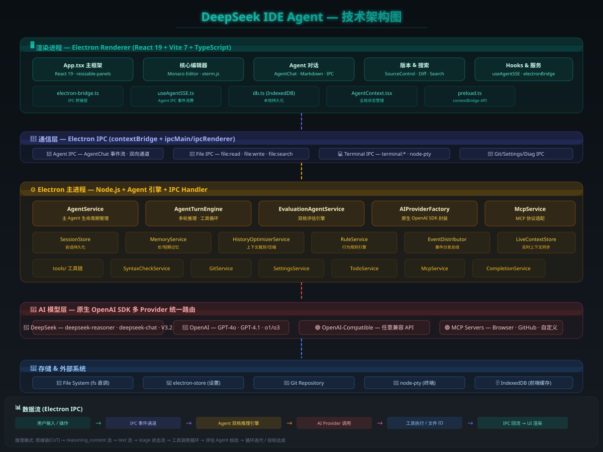

# DeepSeek IDE Agent

<p align="center">
  
  
  
  
  
</p>

<p align="center">
  <b>🧠 双核 AI Agent 驱动的 Electron 桌面 IDE</b> — 让 AI 直接在您的代码工作区中思考、编码与迭代
</p>

---

## 目录

- [1. 环境要求](#1-环境要求)
- [2. 快速开始](#2-快速开始)
- [3. 使用指南](#3-使用指南)
- [4. 功能特性](#4-功能特性)
- [5. 架构概览](#5-架构概览)
- [6. 构建 & 打包](#6-构建--打包)
- [7. 常见问题](#7-常见问题)

---

## 1. 环境要求

| 依赖 | 版本 | 说明 |
|------|------|------|
| **Node.js** | ≥ 20.x（推荐 20.19+ LTS） | [下载地址](https://nodejs.org/) |
| **npm** | ≥ 10.x | 随 Node.js 附带 |
| **Windows** | 10 / 11 x64 | 当前主要支持平台 |
| **Git** | ≥ 2.30（可选） | 版本控制功能需要 |

> ⚠️ **Windows 用户注意**：`node-pty` 包含 C++ 原生模块，需安装 [Visual Studio Build Tools](https://visualstudio.microsoft.com/downloads/#build-tools-for-visual-studio-2022)（勾选「使用 C++ 的桌面开发」工作负荷）。或运行：
> ```powershell
> npm install --global windows-build-tools
> ```

---

## 2. 快速开始

### 2.1 克隆仓库

```powershell
git clone https://github.com/your-org/web-ide-agent.git
cd web-ide-agent
```

### 2.2 配置 API Key

在项目根目录创建 `.env` 文件：

```bash
DEEPSEEK_API_KEY=sk-your-api-key-here
DEEPSEEK_MODEL=deepseek-chat
```

> 从 [platform.deepseek.com](https://platform.deepseek.com/api_keys) 获取 API Key。兼容所有 OpenAI 兼容接口的服务商。

### 2.3 安装依赖

```powershell
# 1. 安装前端依赖（React、Monaco Editor 等）
npm install --prefix client

# 2. 安装 Electron 及原生模块（首次需下载 Electron 二进制 ~100MB）
cd electron && npm install && cd ..
```

> 下载缓慢？设置国内镜像加速：
> ```powershell
> $env:ELECTRON_MIRROR="https://npmmirror.com/mirrors/electron/"
> cd electron && npm install && cd ..
> ```

### 2.4 启动

```powershell
# 一键启动开发模式（编译 + Vite + Electron）
npm run electron:dev
```

启动流程：
1. esbuild 编译 `preload.ts` + `main/index.ts`（毫秒级）
2. Vite Dev Server 启动（端口 `5174`，支持 HMR 热更新）
3. Electron 窗口自动打开

> 💡 仅调试前端 UI 时，可直接访问 `http://localhost:5174`。
>
> 📖 详细启动指南：[docs/STARTUP.md](docs/STARTUP.md)

---

## 3. 使用指南

### 3.1 首次启动

1. 启动后 Electron 窗口自动弹出，显示 DeepSeek IDE Agent 主界面。
2. 首次使用需在 **设置（⚙️）** 中配置 AI 模型：
   - 点击左下角齿轮图标打开设置面板
   - 填入 API Key、选择模型（如 `deepseek-chat` 或 `deepseek-reasoner`）
   - 保存配置
3. 点击左侧 **文件树** 面板选择一个文件夹作为工作区（或通过菜单 `文件 → 打开工作区`）。

### 3.2 界面概览

```
┌──────────────────────────────────────────────────┐
│  Header（标题栏 + 工作区路径）                      │
├──────────┬───────────────────────┬───────────────┤
│ FileTree │                       │  Agent Chat   │
│ (文件树) │   FileEditor          │  (AI 对话)    │
│          │   (Monaco 编辑器)      │               │
│          │                       │               │
│          │   - 代码编辑           │  输入指令      │
│          │   - Markdown 预览      │  AI 自动执行   │
│          │   - PDF/图片预览       │  工具调用      │
│          │   - Diff 对比         │  实时反馈      │
├──────────┴───────────────────────┴───────────────┤
│  StatusBar（Git 分支 | 模型信息 | Token 用量）     │
├──────────────────────────────────────────────────┤
│  Bottom Panel（终端 Terminal | 问题列表 Problems）  │
└──────────────────────────────────────────────────┘
```

### 3.3 与 AI Agent 对话

在右侧 **Agent Chat** 面板输入自然语言指令，AI 将自动执行：

| 能力 | 示例指令 |
|------|----------|
| 创建项目 | "帮我创建一个 React + TypeScript 项目" |
| 编写代码 | "在 `src/utils/helper.ts` 中编写一个日期格式化函数" |
| 修改代码 | "把 `UserList.tsx` 中的 class 组件改成函数组件" |
| 修复 Bug | "修复第 42 行的 `undefined` 错误" |
| 终端操作 | "安装 axios 并写一个请求示例" |
| Git 操作 | "查看最近的提交记录" |
| 代码审查 | "检查 `api.ts` 中的潜在安全问题" |

### 3.4 文件编辑

- **语法高亮**：TS、JS、Python、Java、JSON、YAML、HTML、CSS、XML、Markdown 等 15+ 种语言
- **Markdown 预览**：打开 `.md` 文件后点击 `PREVIEW` 按钮实时渲染
- **PDF/图片预览**：直接打开 `.pdf`、`.png`、`.jpg` 等文件即可预览
- **Diff 对比**：在 Git 面板中点击文件查看差异
- **语法检查**：保存文件后自动检查语法（支持 TS/JS/Python/Java/JSON/YAML/HTML/CSS/XML/MD）

### 3.5 终端使用

底部面板的 **Terminal** 提供完整的 PowerShell/CMD 环境：
- 支持 `node`、`npm`、`git`、`python` 等所有命令行工具
- 多终端会话管理
- 快捷键：`Ctrl+S` 保存文件

### 3.6 MCP 工具扩展

在工作区根目录创建 `.mcp/` 文件夹，放入 MCP 配置 JSON 文件，Agent 启动时自动扫描并注入自定义工具：

```json
{
  "name": "github",
  "transport": "stdio",
  "command": "npx",
  "args": ["-y", "@modelcontextprotocol/server-github"],
  "env": { "GITHUB_PERSONAL_ACCESS_TOKEN": "${GITHUB_TOKEN}" }
}
```

---

## 4. 功能特性

### 4.1 双核 Agent 循环

1. **主 Agent**：接收用户指令，调用工具（文件、终端、Git 等），产出代码结果。
2. **评估 Agent**：独立核验主 Agent 产出，生成评估报告，决定是否继续迭代。

### 4.2 内置工具

| 工具类别 | 说明 |
|----------|------|
| 📄 文件操作 | 读取、写入（`file_write`）、行级精修（`file_edit`）、删除工作区文件 |
| 🖥️ 终端命令 | PowerShell / CMD 命令执行（阻塞式，返回完整输出） |
| 🔍 代码搜索 | 工作区内的文件搜索与内容搜索 |
| 📋 文件列表 | 受控递归目录结构获取 |
| 🔀 Git 版本控制 | 查看状态、历史、差异、分支 |
| 🔌 MCP 工具 | 用户自定义 MCP 服务器工具动态注入 |

### 4.3 编辑器特性

- 🎨 Monaco Editor（VS Code 内核）提供专业代码编辑体验
- 🔤 15+ 种编程语言语法高亮与自动补全
- 📝 Markdown 实时预览切换
- 📄 PDF / 图片文件原生预览
- 🔄 Git Diff 并排对比
- ✅ 保存时自动语法检查（TS/JS/Python/Java/JSON/YAML/HTML/CSS/XML）

### 4.4 非代码文件支持

| 文件类型 | 预览方式 | 语法检查 |
|----------|----------|----------|
| `.pdf` | 原生 PDF 阅读器（文字选择/缩放/搜索） | 自动跳过 |
| `.png` `.jpg` `.gif` `.webp` | 原生图片预览 | 自动跳过 |
| `.docx` `.xlsx` `.pptx` | 暂不支持预览 | 自动跳过 |

---

## 5. 架构概览

系统采用 **Electron 单应用** 架构：渲染进程通过 IPC 调用主进程，主进程内置 Agent 引擎直接操作文件系统和 AI API，零网络延迟。

### 功能架构

<p align="center">
  
</p>

### 技术架构

<p align="center">
  
</p>

> 📄 架构图源文件：[docs/functional-architecture.svg](docs/functional-architecture.svg) · [docs/technical-architecture.svg](docs/technical-architecture.svg)

### 项目结构

```
web-ide-agent/
├── .env                          # API Key（不提交 Git）
├── package.json                  # 根 scripts
├── README.md
├── docs/                         # 文档 & 架构图
│   ├── STARTUP.md
│   ├── functional-architecture.svg
│   └── technical-architecture.svg
│
├── client/                       # 前端 React 应用（渲染进程）
│   └── src/
│       ├── components/           # UI 组件（AgentChat、FileEditor、Terminal 等）
│       ├── hooks/                # React Hooks（useAgentSSE、useTerminalConnection）
│       ├── services/             # 服务层（electron-bridge IPC 桥接）
│       └── providers/            # 全局状态（AgentContext）
│
├── server/                       # Agent 核心逻辑（主进程引用）
│   └── src/
│       ├── services/             # AgentService、SyntaxCheckService、工具实现
│       ├── config/               # Agent 提示词 & 模型配置
│       └── tools/                # 自定义工具（CalculatorTool 等）
│
└── electron/                     # Electron 桌面壳
    ├── src/main/
    │   ├── index.ts              # 主进程入口
    │   ├── preload.ts            # 预加载脚本（contextBridge）
    │   └── ipc/                  # IPC 处理器（文件、终端、Git、诊断等）
    └── electron-builder.yml      # 打包配置
```

---

## 6. 构建 & 打包

### 本地构建

```powershell
npm run electron:build    # 构建 preload + main + renderer
```

构建产物：
```
electron/dist/preload.cjs        # 编译后的 preload
electron/dist/main/index.js      # 编译后的主进程
client/dist/                     # Vite 构建的前端静态文件
```

### 生成安装包

```powershell
npm run electron:dist     # 生成当前平台的桌面安装包

# 产物位于 electron/release/
```

> 📦 详细打包配置见 [electron-builder.yml](electron/electron-builder.yml)

---

## 7. 常见问题

### Q: 启动报错 `node-pty` 找不到？
**A**: `node-pty` 是 C++ 原生模块，需要先安装 Visual Studio Build Tools（见[环境要求](#1-环境要求)），然后重建：
```powershell
cd electron && npm rebuild node-pty && cd ..
```

### Q: Electron 窗口白屏？
**A**: 确认 `.env` 文件存在且 API Key 有效。打开 DevTools（`Ctrl+Shift+I`）查看控制台错误。

### Q: PDF 文件无法预览？
**A**: 确保 Electron 版本 ≥ 28，且 `webSecurity: true`（默认）。如遇 `ERR_BLOCKED_BY_CLIENT`，检查是否有浏览器扩展拦截。

### Q: 终端无法输入中文？
**A**: 当前 `node-pty` + `xterm.js` 组合在 Windows 上对 CJK 字符支持有限，建议在终端中避免直接输入中文。

### Q: 如何切换 AI 模型？
**A**: 点击左下角齿轮图标 → 设置面板 → 选择或添加模型 → 保存。支持所有 OpenAI 兼容 API。

### Q: 如何添加自定义 MCP 工具？
**A**: 在工作区根目录创建 `.mcp/` 文件夹，放入 JSON 配置文件（格式见[第 3.6 节](#36-mcp-工具扩展)），重启应用即可。

---

<p align="center">
  <sub>Built with ❤️ using DeepSeek · Electron · React · TypeScript</sub>
</p>
}
```

工具将以 `{服务器名}__{原生工具名}` 格式注册（如 `github__search_repositories`），对 AI 模型完全透明。

> **离线环境注意**：如果在无网络的生产机上使用 MCP 工具，需将 MCP 服务器的 npm 包预先打包部署。详见 [DEPLOYMENT.md](./DEPLOYMENT.md) 第 1.3.3 节。

### Agent 行为契约（关键硬约束）

## 6. 常见问题

### Q1：启动后 Electron 白屏？

检查终端中是否显示 `[VITE] Dev server ready`。手动访问 `http://localhost:5174` 确认前端可用。如果端口被占用，`dev.mjs` 会自动清理。

### Q2：AI 对话无响应？

确认 `.env` 中 `DEEPSEEK_API_KEY` 有效。可手动测试：
```powershell
Get-Content d:\web-ide-agent\.env
```

### Q3：如何离线部署？

构建安装包后直接分发 `electron/release/` 中的 `.exe` 文件即可，无需 Node.js 环境。

### Q4：`node-pty` 编译失败？

安装 [Visual Studio Build Tools](https://visualstudio.microsoft.com/downloads/#build-tools-for-visual-studio-2022)，勾选 "Desktop development with C++"。


```bash
# 1. 拷贝项目
cp -r deepseek-ide-agent deepseek-ide-agent-2    # macOS/Linux


## 7. 项目结构

```
web-ide-agent/
├── .env                    ← API Key 配置
├── package.json            ← 根级脚本
├── client/                 ← 前端（React 19 + Vite + Monaco Editor）
│   └── src/
│       ├── components/     ← UI 组件
│       ├── services/       ← electron-bridge IPC 桥接
│       └── providers/      ← React Context
├── server/                 ← Agent 核心逻辑（被 Electron 主进程引用）
│   └── src/
│       ├── config/         ← Agent 提示词配置
│       ├── services/       ← AgentEngine、McpService、GitService 等
│       └── tools/          ← Agent 工具实现
├── electron/               ← Electron 桌面应用
│   └── src/
│       └── main/
│           ├── index.ts    ← 主进程入口
│           ├── preload.ts  ← 安全桥接
│           └── ipc/        ← IPC 处理器（agent/file/terminal/git/...）
└── docs/
    └── STARTUP.md          ← 启动指南
```

---

## 11. 安全提醒

- ❌ **不要提交**：`.env`、API Key、Token、密码、私钥证书
- ❌ **不要提交**：`node_modules/`、`dist/`、`.temp/`、临时缓存文件
- ✅ **提交前检查**：
  ```bash
  git status
  ```
- `.env.example` 仅包含示例值，可安全提交；`.env` 已在 `.gitignore` 中排除
