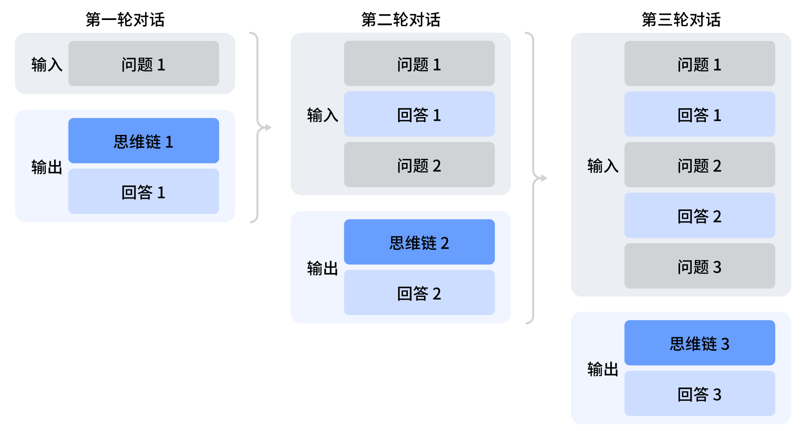
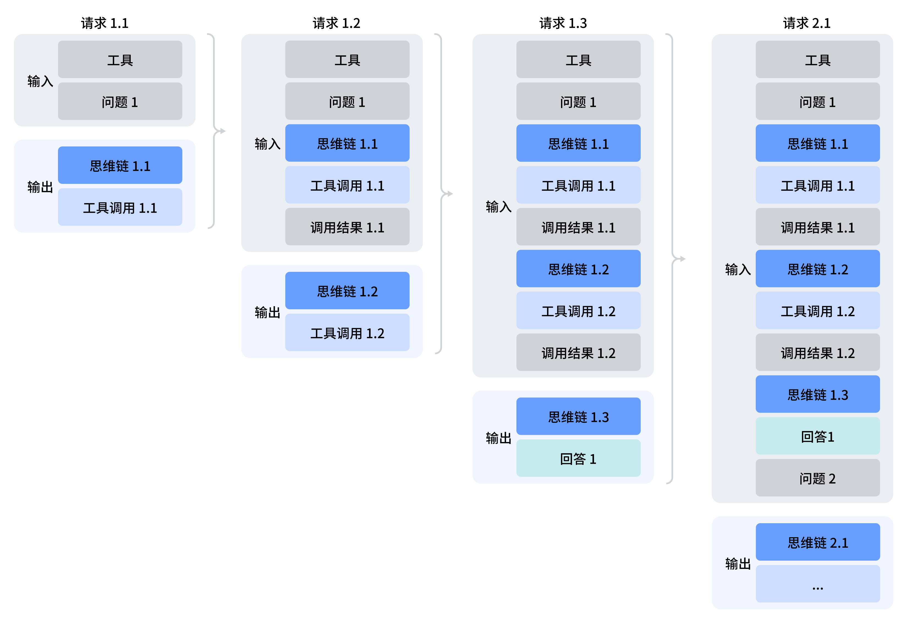

# 思考模式 (Thinking Mode)

> 本文档同步自 DeepSeek 官方 API 文档：<https://api-docs.deepseek.com/zh-cn/guides/thinking_mode>
> 首次同步：2026-04-25 ｜ 最近同步：2026-09-10

DeepSeek 模型支持思考模式：在输出最终回答之前，模型会先输出一段思维链内容，以提升最终答案的准确性。

---

## 思考模式开关与思考强度控制

| 控制项 | 控制参数（OpenAI 格式） | 控制参数（Anthropic 格式） | 控制参数（Responses API 格式） |
| --- | --- | --- | --- |
| 思考模式开关 <sup>(1)</sup> | `{"thinking": {"type": "enabled/disabled"}}` <sup>(3)</sup> | `{"thinking": {"type": "enabled/disabled"}}` <sup>(3)</sup> | `{"reasoning": {"effort": "none/low/high/max"}}`<br>（`none` 表示关闭思考模式）<sup>(4)</sup> |
| 思考强度控制 <sup>(2)</sup> | `{"reasoning_effort": "low/high/max"}` | `{"output_config": {"effort": "low/high/max"}}` | 同上一行单元格<br>（该列由 `reasoning.effort` 同时承担开关与强度控制）<sup>(4)</sup> |

<sup>(1)</sup> 思考模式默认打开，且 `effort` 默认为 `high`。
<sup>(2)</sup> 用户设置的 `effort` 与模型推理 `effort` 的映射关系见下表。
<sup>(3)</sup> 官网原表中该单元格横向合并了 OpenAI / Anthropic 两列，此处按列展开，两列取值相同。
<sup>(4)</sup> 官网原表中该单元格纵向合并两行。

**思考强度映射表（请求传入 `effort` → 实际映射 `effort`）：**

| 请求传入 `effort` | 实际映射 `effort` |
| --- | --- |
| `minimal` | `low` |
| `low` | `low` |
| `medium` | `high` |
| `high` | `high` |
| `xhigh` | `high` |
| `max` | `max` |
| `ultra` | `max` |

您在 OpenAI SDK 中**使用 Chat Completion** 设置 `thinking` 参数时，需要将 `thinking` 参数传入 `extra_body` 中：

```python
response = client.chat.completions.create(
    model="deepseek-flash",
    # ...
    reasoning_effort="high",
    extra_body={"thinking": {"type": "enabled"}}
)
```

---

## 输入输出参数

思考模式**不支持** `temperature`、`presence_penalty`、`frequency_penalty` 参数。请注意，为了兼容已有软件，设置这些参数不会报错，但也不会生效。

`top_p` 在思考模式下生效，但下限为 `0.95`：小于 `0.95` 的值会被抬升至 `0.95`。在非思考模式下，该参数恒为 `1.0`，传入的值会被忽略。

在思考模式下，思维链内容通过 `reasoning_content` 参数返回，与 `content` 同级。在后续轮次的请求中，`reasoning_content` 是否需要回传、是否会被拼接进上下文，取决于请求**是否携带 `tools` 参数**：

- 若请求**携带** `tools` 参数：历史轮次的 `reasoning_content` 均应回传给 API，并会被拼接进上下文。详见 [工具调用](#工具调用)。
- 若请求**未携带** `tools` 参数：`reasoning_content` 无需回传；即使传入 API，也会被忽略，不会拼接进上下文。详见 [多轮对话拼接](#多轮对话拼接)。

**输出字段：**

- `reasoning_content`：思维链内容，与 `content` 同级。
- `content`：最终回答内容。
- `tool_calls`：模型工具调用。

> 📌 本地补充说明：官网新版页面已不再单列「输出字段」小节。上述三个字段仍出现在官网各示例的收包代码中，是实现时的实际字段，故保留在本同步文档内以便查阅。

---

## 多轮对话拼接

在每一轮对话过程中，模型会输出思维链内容（`reasoning_content`）和最终回答（`content`）。如果请求**未携带** `tools` 参数，则在下一轮对话中，之前轮输出的思维链内容不会被拼接到上下文中，如下图所示：



### 样例代码

下面的代码以 Python 语言为例，展示了如何访问思维链和最终回答，以及如何在多轮对话中进行上下文拼接。

#### 非流式

```python
from openai import OpenAI
client = OpenAI(api_key="<DeepSeek API Key>", base_url="https://api.deepseek.com")

# Turn 1
messages = [{"role": "user", "content": "9.11 and 9.8, which is greater?"}]
response = client.chat.completions.create(
    model="deepseek-flash",
    messages=messages,
    reasoning_effort="high",
    extra_body={"thinking": {"type": "enabled"}},
)

reasoning_content = response.choices[0].message.reasoning_content
content = response.choices[0].message.content

# Turn 2
# The reasoning_content will be ignored by the API
messages.append(response.choices[0].message)
messages.append({'role': 'user', 'content': "How many Rs are there in the word 'strawberry'?"})
response = client.chat.completions.create(
    model="deepseek-flash",
    messages=messages,
    reasoning_effort="high",
    extra_body={"thinking": {"type": "enabled"}},
)
# ...
```

#### 流式

```python
from openai import OpenAI
client = OpenAI(api_key="<DeepSeek API Key>", base_url="https://api.deepseek.com")

# Turn 1
messages = [{"role": "user", "content": "9.11 and 9.8, which is greater?"}]
response = client.chat.completions.create(
    model="deepseek-flash",
    messages=messages,
    stream=True,
    reasoning_effort="high",
    extra_body={"thinking": {"type": "enabled"}},
)

reasoning_content = ""
content = ""

for chunk in response:
    if chunk.choices[0].delta.reasoning_content:
        reasoning_content += chunk.choices[0].delta.reasoning_content
    else:
        content += chunk.choices[0].delta.content

# Turn 2
# The reasoning_content will be ignored by the API
messages.append({"role": "assistant", "reasoning_content": reasoning_content, "content": content})
messages.append({'role': 'user', 'content': "How many Rs are there in the word 'strawberry'?"})
response = client.chat.completions.create(
    model="deepseek-flash",
    messages=messages,
    stream=True,
    reasoning_effort="high",
    extra_body={"thinking": {"type": "enabled"}},
)
# ...
```

> 📌 本地补充说明：官网两段示例中 `reasoning_effort="high"` 后均缺少逗号（直接接 `extra_body=`），此处按可直接运行的形式补全，其余与官网逐字一致。

---

## 工具调用

DeepSeek 模型的思考模式支持工具调用功能。模型在输出最终答案之前，可以进行多轮的思考与工具调用，以提升答案的质量。其调用模式如下图所示：



请注意，**携带了 `tools` 参数的请求，在后续所有请求中必须完整回传 `reasoning_content` 给 API——即使该轮模型未实际进行工具调用**。

> 📌 本地补充说明：即判断依据是「请求是否携带 `tools` 参数」，而不是「该轮是否真的产生了 `tool_calls`」。

若您的代码中未正确回传 `reasoning_content`，API 会返回 400 报错。正确回传方法请您参考下面的样例代码。

### 样例代码

下面是一个简单的在思考模式下进行工具调用的样例代码：

```python
import os
import json
from openai import OpenAI
from datetime import datetime

# The definition of the tools
tools = [
    {
        "type": "function",
        "function": {
            "name": "get_date",
            "description": "Get the current date",
            "parameters": { "type": "object", "properties": {} },
        }
    },
    {
        "type": "function",
        "function": {
            "name": "get_weather",
            "description": "Get weather of a location, the user should supply the location and date.",
            "parameters": {
                "type": "object",
                "properties": {
                    "location": { "type": "string", "description": "The city name" },
                    "date": { "type": "string", "description": "The date in format YYYY-mm-dd" },
                },
                "required": ["location", "date"]
            },
        }
    },
]

# The mocked version of the tool calls
def get_date_mock():
    return datetime.now().strftime("%Y-%m-%d")

def get_weather_mock(location, date):
    return "Cloudy 7~13°C"

TOOL_CALL_MAP = {
    "get_date": get_date_mock,
    "get_weather": get_weather_mock
}

def run_turn(turn, messages):
    sub_turn = 1
    while True:
        response = client.chat.completions.create(
            model='deepseek-flash',
            messages=messages,
            tools=tools,
            reasoning_effort="high",
            extra_body={ "thinking": { "type": "enabled" } },
        )
        messages.append(response.choices[0].message)
        reasoning_content = response.choices[0].message.reasoning_content
        content = response.choices[0].message.content
        tool_calls = response.choices[0].message.tool_calls
        print(f"Turn {turn}.{sub_turn}\n{reasoning_content=}\n{content=}\n{tool_calls=}")
        # If there is no tool calls, then the model should get a final answer and we need to stop the loop
        if tool_calls is None:
            break
        for tool in tool_calls:
            tool_function = TOOL_CALL_MAP[tool.function.name]
            tool_result = tool_function(**json.loads(tool.function.arguments))
            print(f"tool result for {tool.function.name}: {tool_result}\n")
            messages.append({
                "role": "tool",
                "tool_call_id": tool.id,
                "content": tool_result,
            })
        sub_turn += 1
    print()

client = OpenAI(
    api_key=os.environ.get('DEEPSEEK_API_KEY'),
    base_url=os.environ.get('DEEPSEEK_BASE_URL'),
)

# The user starts a question
turn = 1
messages = [{
    "role": "user",
    "content": "How's the weather in Hangzhou Tomorrow"
}]
run_turn(turn, messages)

# The user starts a new question
turn = 2
messages.append({
    "role": "user",
    "content": "How's the weather in Guangzhou Tomorrow"
})
run_turn(turn, messages)
```

在 Turn 1 的每个子请求中，都携带了该 Turn 下产生的 `reasoning_content` 给 API，从而让模型继续之前的思考。`response.choices[0].message` 携带了 `assistant` 消息的所有必要字段，包括 `content`、`reasoning_content`、`tool_calls`。简单起见，可以直接用如下代码将消息 append 到 `messages` 结尾：

```python
messages.append(response.choices[0].message)
```

这行代码等价于：

```python
messages.append({
    'role': 'assistant',
    'content': response.choices[0].message.content,
    'reasoning_content': response.choices[0].message.reasoning_content,
    'tool_calls': response.choices[0].message.tool_calls,
})
```

且在 Turn 2 的请求中，我们仍然携带着 Turn 1 所产生的 `reasoning_content` 给 API。

**该代码的样例输出如下：**

```text
Turn 1.1
reasoning_content="The user is asking about the weather in Hangzhou tomorrow. I need to get tomorrow's date first, then call the weather function."
content="Let me check tomorrow's weather in Hangzhou for you. First, let me get tomorrow's date."
tool_calls=[ChatCompletionMessageFunctionToolCall(id='call_00_kw66qNnNto11bSfJVIdlV5Oo', function=Function(arguments='{}', name='get_date'), type='function', index=0)]
tool result for get_date: 2026-04-19

Turn 1.2
reasoning_content="Today is 2026-04-19, so tomorrow is 2026-04-20. Now I'll call the weather function for Hangzhou."
content=''
tool_calls=[ChatCompletionMessageFunctionToolCall(id='call_00_H2SCW6136vWJGq9SQlBuhVt4', function=Function(arguments='{"location": "Hangzhou", "date": "2026-04-20"}', name='get_weather'), type='function', index=0)]
tool result for get_weather: Cloudy 7~13°C

Turn 1.3
reasoning_content='The weather result is in. Let me share this with the user.'
content="Here's the weather forecast for **Hangzhou tomorrow (April 20, 2026)**:\n\n- 🌤 **Condition:** Cloudy  \n- 🌡 **Temperature:** 7°C ~ 13°C (45°F ~ 55°F)\n\nIt'll be on the cooler side, so you might want to bring a light jacket if you're heading out! Let me know if you need anything else."
tool_calls=None

Turn 2.1
reasoning_content='The user is asking about the weather in Guangzhou tomorrow. Today is 2026-04-19, so tomorrow is 2026-04-20. I can directly call the weather function.'
content=''
tool_calls=[ChatCompletionMessageFunctionToolCall(id='call_00_8URkLt5NjmNkVKhDmMcNq9Mo', function=Function(arguments='{"location": "Guangzhou", "date": "2026-04-20"}', name='get_weather'), type='function', index=0)]
tool result for get_weather: Cloudy 7~13°C

Turn 2.2
reasoning_content='The weather result for Guangzhou is the same as Hangzhou. Let me share this with the user.'
content="Here's the weather forecast for **Guangzhou tomorrow (April 20, 2026)**:\n\n- 🌤 **Condition:** Cloudy  \n- 🌡 **Temperature:** 7°C ~ 13°C (45°F ~ 55°F)\n\nIt'll be cool and cloudy, so a light jacket would be a good idea if you're going out. Let me know if there's anything else you'd like to know!"
tool_calls=None
```

> 📌 本地补充说明：从输出可以看到，Turn 1.2 与 Turn 2.1 的 `content` 为空字符串，但 `reasoning_content` 与 `tool_calls` 均有值——思考模式下的中间子轮次可以只输出思维链和工具调用。

---

## 本次同步变更摘要（2026-09-10 相对 2026-04-25 版）

> ⚠️ 可信度声明：「旧版（2026-04-25）」列基于更新前的印象整理，工作区为非 git 仓库、无更新前副本，**该列内容未经独立复核**；「新版」列已逐项与官网现行页面核对。

| # | 变更点 | 旧版（2026-04-25，未经复核） | 新版（2026-09-10，已核验官网） |
| --- | --- | --- | --- |
| 1 | 示例模型名 | `deepseek-v4-pro` | `deepseek-flash` |
| 2 | 控制参数格式 | 仅 OpenAI / Anthropic 两列 | 新增 Responses API 列 `{"reasoning": {"effort": "none/low/high/max"}}`，`none` 表示关闭思考模式 |
| 3 | 思考强度映射 | 仅说明 `low`/`medium` → `high`、`xhigh` → `max` | 给出完整映射表：新增 `minimal` → `low`、`ultra` → `max`；**`xhigh` 由映射为 `max` 改为映射为 `high`** |
| 4 | 默认 effort 说明 | 普通请求默认 `high`；Claude Code / OpenCode 等 Agent 类请求自动设为 `max` | 简化为「思考模式默认打开，且 `effort` 默认为 `high`」，不再提自动 `max` |
| 5 | `top_p` | 与 `temperature`、`presence_penalty`、`frequency_penalty` 一并列为「不支持」 | 移出「不支持」列表，新增「思考模式下生效，但下限 `0.95`；非思考模式下恒为 `1.0`，传入值被忽略」 |
| 6 | `reasoning_content` 回传判定 | 取决于两轮 `user` 之间**是否实际发生工具调用** | 取决于请求**是否携带 `tools` 参数**（即使该轮未实际调用工具，只要带 `tools` 就必须回传） |
| 7 | 工具调用章节结构 | 单列 H3「兼容性提示」，400 报错说明独立成节 | 「兼容性提示」并入正文，回传要求与 400 报错以连续两段表述（另附 📌 本地补充说明） |
| 8 | 流式样例 Turn 2 | `messages.append({"role": "assistant", "content": content})` | 显式回传思维链：`messages.append({"role": "assistant", "reasoning_content": reasoning_content, "content": content})` |
| 9 | 样例输出 | 无 | 新增工具调用样例的完整输出（Turn 1.1 ~ Turn 2.2） |
| 10 | 「输出字段」小节 | 独立列出 `reasoning_content` / `content` / `tool_calls` | 官网页面已移除，本文档保留并标注为本地补充 |
| 11 | 示例代码标点 | 无 | 官网两处 `reasoning_effort="high"` 后缺逗号，本文档按可运行形式补全 |

**对接实现提示（针对本项目 coding agent）：**

- 本项目会话默认携带 `tools`，因此**每一轮** `assistant` 消息的 `reasoning_content` 都必须原样回传；拼接历史上下文时不能丢弃该字段，否则 API 返回 400。
- 思考强度取值以 `low` / `high` / `max` 为准（OpenAI 格式，即 `reasoning_effort`）；其余别名（`minimal`、`medium`、`xhigh`、`ultra`）可传入但会被归一化映射。
- 思考模式下 `temperature`、`presence_penalty`、`frequency_penalty` 传入不报错但不生效；如需调节随机性，应改用 `top_p`，且有效下限为 `0.95`。
- 使用 Anthropic 格式时，开关为 `{"thinking": {"type": "enabled/disabled"}}`，强度为 `{"output_config": {"effort": "low/high/max"}}`；使用 Responses API 格式时，开关与强度统一由 `{"reasoning": {"effort": "none/low/high/max"}}` 控制。
- **实现现状（2026-09-10 已对齐本口径）**：`coding-agent/src/llm/payload.js` 的 `toApiMessage` 在 `withReasoning` 下对所有含 `reasoning` 的 assistant 轮回传 `reasoning_content`（不再仅限工具轮）；`coding-agent/src/core/context.js` 的 token 估算按同一口径计入 reasoning 成本；冒烟测试 `coding-agent/test/smoke.js` 已覆盖「无 `tool_calls` 的最终答复轮同样回传」。
